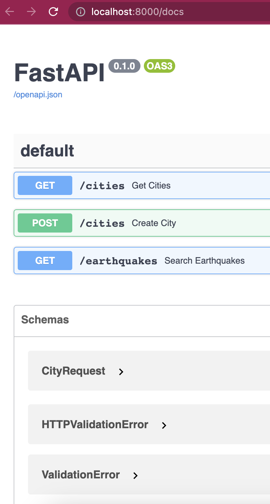
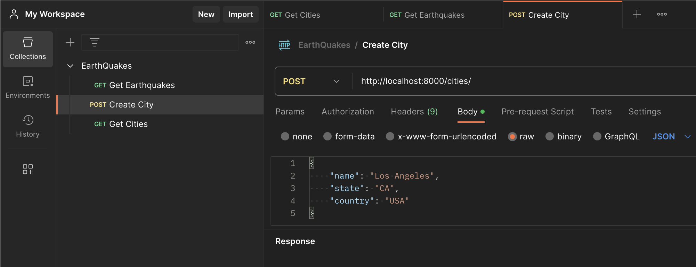

# Eartquake API
Our application is a comprehensive system that leverages the USGS Earthquakes public data set to provide users with valuable information about earthquakes and cities. The system is built using REST APIs, allowing users to easily access and interact with the data. 

By utilizing these APIs, users can retrieve relevant earthquake information, such as magnitude, location, and date/time, as well as obtain details about cities.

-----
## Dataset
https://earthquake.usgs.gov/earthquakes/search/

-----
## Used Stack
```
Docker          v20.10.21
Docker Compose  v2.13.0
Python          v3.8
pip             v21.2.4
```
Main tech used: Python, Mysql, SqlAlchemy, Pandas, FastAPI, GeoPy


-----
## Local Setup
``` bash
# Duplicate env template
$ cp .env.template .env

#---- Manual step: Configure your local environmental variables at .env file (optional) ----

$ docker-compose up -d

$ make venv
$ source venv/bin/activate
$ make install

#---- Database Migration ----
$ make db-upgrade
```

-----
## Database migration
Database migration is the process of making changes to a database schema or data while preserving existing information and application functionality.

Alembic is a Python-based database migration tool commonly used for managing schema changes.

It allows developers to define changes using Python scripts called "migrations" and applies them in a sequential order.

Alembic tracks the migration history, enabling easy rollbacks and ensuring consistency across environments.

It offers a command-line interface and integrates well with various database systems, making it versatile and reliable for managing database migrations.

Please read alembic/README for more information.

-----
## Makefile
Contains helpful commands used in everyday life.

-----
## Implementation
``` bash
./src/config/       # Config / Infrastructure (e.g, database)
./src/exceptions/   # Custom exceptions
./src/integration/  # Integration with external systems (third parties or public data)
./src/models/       # Database models (e.g., SQLAlchemy models)
./src/routers/      # Router instance and routes
./src/schemas/      # Data "schemas" (e.g., Pydantic models)
./src/services/     # Business logic
./src/app.py        # Main app
./alembic/versions  # Contains database migration scripts (ddl/dml)
```

-----
## Cache Solution
`requests_cache` is a Python package that allows to cache API responses effortlessly. It transparently intercepts and stores API responses, reducing redundant requests and enhancing performance. It offers flexible caching strategies and supports different storage backends. Integration is easy, requiring minimal code changes. By caching API responses, it optimizes applications with rate limits, large response sizes, or slow servers.

-----
## API Documentation / Swagger
`FastAPI`, a Python web framework, provides built-in support for automatic API documentation generation using `Swagger`. Swagger UI allows developers to explore and test APIs through an interactive and user-friendly interface. With FastAPI's type hints and intuitive decorators, API endpoints and models are automatically documented, including request/response models, headers, and status codes. The Swagger UI can be accessed via a dedicated endpoint, providing comprehensive documentation and an API playground. This built-in feature saves time and effort, ensuring accurate and up-to-date API documentation that aids in API consumption and integration by developers.

http://localhost:8000/docs



-----
## Postman
`Postman` is a popular API development and testing tool that simplifies the process of working with APIs. It provides an intuitive interface for making API requests, organizing and managing collections, and automating tests, making it a valuable tool for developers and testers.

https://api.postman.com/collections/26530044-9a931503-47f7-45fb-bf50-5edfdd950b3f?access_key=PMAT-01H37C4GBMZ6YP9838XH7D50NG

Since we don't have relevant/sensitive information at Postman, I'm sharing the collection here. You can import the collection with requests into your Postman.
In a real environment, we would have an shared environment with the team to collaborate.



-----
## Tests

- Unit Tests:

    Test individual functions, methods, or classes in isolation.
    Mock external dependencies or collaborators.
    - src/tests/unit/routers:
    test a specific endpoint handler function, validating request and response data
    - src/tests/unit/services:
    test a specific logic/transformation

    ``` bash
    $ make unit-tests
    ```

- Integration Tests (TODO):

    Test the interaction between different components or modules within your application.
    Use a live test database or mock the database layer using tools like pytest-mock or an in-memory database.
    Example integration tests for a FastAPI application could include testing the interaction between multiple endpoints, testing database operations, or testing the integration of external services.

- End-to-End Tests (TODO):

    Test the application as a whole, simulating real user interactions.
    Use tools like TestClient from fastapi.testclient to send requests to the running application.
    Example end-to-end tests for a FastAPI application could include testing the complete user flow, checking the behavior of multiple endpoints together, or validating the API responses against expected results.

- Performance Tests (TODO):

    Test performance in Python code and simulate the desired user behavior to stress test your FastAPI application. It allows you to control the load, measure response times, and analyze the performance of your application under different scenarios.

    Locust is an open-source, Python-based performance testing framework that allows you to write load tests in Python code.

    https://locust.io/

-----
## Github actions

GitHub Actions automates unit testing on every commit to the main branch, ensuring code quality and functionality. 
This continuous testing approach reduces bugs in production, promoting stable and reliable software. GitHub Actions provides an integrated workflow, triggering tests with each commit. By automating testing, we prioritize stability, integrity, and quality, facilitating faster iterations and an improved development experience.

Config file: .github/workflows/python-app.yml

-----
## Next Steps / Improvements:
- Include Black (code formatter) and enforce PEP8 style guidelines
- Improve swagger documentation defining response class: https://fastapi.tiangolo.com/tutorial/sql-databases/
- Improve service abstraction by creating Service Results: https://camillovisini.com/article/abstracting-fastapi-services/
- Implement authentication (oauth, user, JWT)
- Implement integration, end-to-end and performance tests
- Implement exception handler : https://fastapi.tiangolo.com/tutorial/handling-errors/ and then implement unit tests to check exception http results